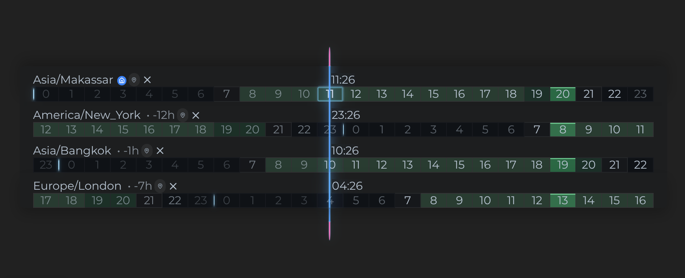

# I needed a collision engine for a React timeline. Here is how I built it.

When I started Timespace in January 2024, I expected time zones to be the hard
part.

I was wrong. Time zones were difficult, but the problem that consumed the most
time was much more visual: how do you stop several absolutely positioned DOM
labels from covering one another while the user is dragging them?

The result is the collision resolver inside
[react-timespace](https://github.com/it-pal-net/react-timespace), an open-source
React component for comparing several time zones on one timeline.



The component puts one 24-hour strip on each row. The rows show different local
times, but every horizontal position represents the same moment. A user can
drag an interval across all of them to see when a meeting or work block would
happen in New York, London, Bangkok, or anywhere else.

Drawing 24 boxes was easy. The labels were trouble.

## What could collide?

There are several kinds of floating elements in the widget:

- the clock attached to the live "now" line;
- a clock attached to each endpoint of every selected interval;
- the time-zone name and controls at the edge of each row;
- the left and right edges of the hour strip.

Every clock is an absolutely positioned DOM element. A label can sit to the
left or right of its anchor, and its width changes with the font, theme, time
format, and whether seconds are shown.

Near the right edge, a label can leave the container. If two interval
endpoints are close together, their labels can overlap. The live clock can run
into an interval. All of this changes while the pointer is moving, and every
position becomes stale when the container resizes.

CSS knows how wide an element is, but it cannot make the decision I needed:

> Try this label on the other side of its anchor. Keep it there only if it fits
> and does not hit another label. If neither side works, give it a vertical
> lane.

At that point I was no longer styling a timeline. I was writing a small layout
engine.

## Time is the value; pixels are the current view

Before collision detection, I needed one stable coordinate model.

A day contains 86,400 seconds. The timeline has a width measured from the real
DOM. Mapping between the two is linear:

```js
const SECONDS_IN_DAY = 24 * 60 * 60;

function secondsToX(seconds, width, left) {
  return (seconds / SECONDS_IN_DAY) * width + left;
}

function xToSeconds(x, width, left) {
  return ((x - left) / width) * SECONDS_IN_DAY;
}
```

The real helpers live in
[`core/timeLineMath.js`](../core/timeLineMath.js). They also account for two
offsets: the hour strip inside the list, and the list inside the viewport.

That detail caused some painful bugs. CSS positions are relative to the
component. Pointer events use viewport coordinates. Collision detection only
works if all of its inputs use the same coordinate space.

Each interval keeps two representations:

- `xPos1DayOffsetSeconds` and `xPos2DayOffsetSeconds` describe the actual time;
- `xPos1` and `xPos2` are the pixel positions used for the current render and
  drag.

When the widget resizes, it recalculates pixels from seconds. A point at 14:00
stays at 14:00 instead of staying at an obsolete x-coordinate.

This sounds obvious now. It was not obvious when the first responsive version
kept moving selected times after every resize.

## Measuring the scene

I did not want to guess clock widths from character counts. Fonts and themes
make that unreliable, so the widget renders sample labels and measures them.

[`useTimeLineMeasurements`](../hooks/useTimeLineMeasurements.js) records:

- the width and viewport position of the hour strip;
- the natural width of an interval clock;
- the natural width of the live clock;
- the widest time-zone header;
- the height available for labels.

A targeted `ResizeObserver` reruns the measurement when the container changes
size. There is also a short-lived `MutationObserver` for labels that are empty
on the first render and receive their clock text just after mounting.

The collision resolver itself does not query the DOM. It receives the measured
numbers and returns layout data, which makes the geometry deterministic and
testable.

## Reducing DOM rectangles to horizontal intervals

The important information is horizontal: the anchor position, the label width,
and the side on which it is rendered.

For collision detection, I turn every label into a one-dimensional interval:

```js
function getBoundaryPositions(position, width, isLeftSide) {
  if (isLeftSide) {
    return {
      start: position - width,
      end: position,
      width,
    };
  }

  return {
    start: position,
    end: position + width,
    width,
  };
}

function boundariesOverlap(first, second) {
  return first.end > second.start && first.start < second.end;
}
```

The production implementation is in
[`core/timeLineCollision.js`](../core/timeLineCollision.js).

Why make the problem one-dimensional when DOM elements are two-dimensional?
Because horizontal position has meaning: it represents time. Vertical movement
does not. Moving a clock up or down is only a fallback when its horizontal
conflict cannot be removed.

## First try: move the label to the other side

The normal preferred side is the right. Keeping one default avoids unnecessary
visual movement.

For every movable label, the resolver does roughly this:

1. Build its horizontal boundary on the current side.
2. Move it to the preferred side when that side fits.
3. If it crosses the timeline boundary, try the opposite side.
4. If it overlaps another item, try the opposite side again.
5. Accept the switch only when the new position is inside the timeline and
   does not collide with any other current boundary.

Switching a label from right to left is just a translation by its measured
width:

```js
function calculateOppositeSidePosition(
  clockBoundary,
  clockWidth,
  side,
  leftBoundary,
  rightBoundary,
) {
  if (side === "left") {
    const start = clockBoundary.start + clockWidth;
    const end = clockBoundary.end + clockWidth;

    return end <= rightBoundary
      ? { ...clockBoundary, side: "right", start, end }
      : clockBoundary;
  }

  const start = clockBoundary.start - clockWidth;
  const end = clockBoundary.end - clockWidth;

  return start >= leftBoundary
    ? { ...clockBoundary, side: "left", start, end }
    : clockBoundary;
}
```

The row header is slightly different. It is an obstacle, but its side is
chosen from the position of the live time. When the "now" line approaches the
header, the header moves to the other end of the row.

I deliberately did not make this a solver that flips labels back and forth
until it finds a theoretical optimum. It runs a predictable pass. During a
drag, a stable decision is more valuable than a marginally tighter global
layout that may change from frame to frame.

## When neither side works

Some collisions cannot be fixed horizontally. Several endpoints may represent
the same time, or a label may be trapped between the live clock and the row
header.

Those remaining bounds form an interval graph. The current resolver sorts them
by start position and assigns vertical lanes greedily:

```text
for each label from left to right:
    find the first lane whose previous label has already ended
    if no lane is free, create a new one
```

Because these are intervals, a lane can be reused as soon as its last `end` is
less than or equal to the next `start`.

There is one extra rule for visual stability. Consider this chain:

```text
A overlaps B
B overlaps C
A does not overlap C
```

All three belong to one connected horizontal group. I calculate one stack size
for the group, rather than giving each label a size based only on its direct
neighbors. Otherwise B can end up smaller than A and C even though they are all
part of the same visual collision.

The resolver returns more than a boolean. Each item receives:

- the chosen side;
- the indexes of the items it overlaps;
- its vertical lane;
- the number of lanes in its connected group.

[`useTimeLineCollisionResolution`](../hooks/useTimeLineCollisionResolution.js)
turns that result into a top offset, font size, scale, and z-index.

The original 2024 engine handled the live clock, the header, and the two ends of
one interval. The open-source version now resolves every visible interval in
one collective pass. That was an important change: layouts from different
intervals cannot be correct if each interval pretends the others do not exist.

## A feedback loop I did not expect

One of the strangest bugs came from measuring a header after shrinking it.

The loop looked like this:

1. Measure a wide time-zone name.
2. Detect a collision and reduce its font size.
3. Measure the now-narrow name.
4. Decide the collision is gone and restore the font.
5. Measure the wide name again.

The layout could oscillate without any user input.

The fix was to separate measured geometry from visual scale. The resolver
always uses the header's natural width. When the label needs to shrink, the
rendering uses a CSS transform. Its appearance changes, but the measurement
that produced the collision decision stays stable.

The same principle applies to state updates. Before applying a result, the
hook compares the fields that affect layout. If nothing changed, it returns
the existing state object. Without that guard, a render-measure-resolve system
can easily update itself forever.

## Dragging outside the component

My first drag implementation relied too much on events from the timeline
element. It worked until the pointer left the list or a release happened
outside it.

The current
[`useTimeIntervalDrag`](../hooks/useTimeIntervalDrag.js) starts with
`pointerdown` on an invisible 16-pixel grab strip and installs
`pointermove`/`pointerup` listeners on `window`.

That gives the interaction a few useful properties:

- dragging continues outside the component;
- mouse, touch, and pen use the same event path;
- `pointercancel` and window blur end the session safely;
- Escape restores the interval captured at the start of the drag.

Pointer moves are coalesced with `requestAnimationFrame`. The latest pointer
position wins, and the component runs no more than one geometry and collision
pass per frame.

The normal snap step is configurable. Ctrl or Cmd changes it to one second;
Shift changes it to five minutes. Moving the whole range snaps its leading
edge while preserving the distance between both endpoints.

## State management: two different speeds

Timespace does not use Redux or another state library. Its public state layer
is a React context and reducer in
[`state/timeZonesProvider.jsx`](../state/timeZonesProvider.jsx).

Timelines and intervals are stored as normalized resources:

```text
timeLinesIds       + timeLinesMap
timeIntervalsIds   + timeIntervalsMap
```

The maps make updates by ID simple. Memoized arrays give the renderer an
ordered list. Public actions such as `setTimelines`, `updateTimeline`, and
`addTimeInterval` hide the reducer details from the host application.

The more important decision was splitting the state into two contexts:

```text
data context:  timelines, intervals, settings, dispatch
clock context: current time, zoned clocks, day progress
```

These values change at very different speeds. A user may update an interval a
few times during a drag, but the clock changes continuously.

The ticker schedules itself on the next exact interval boundary. It reads
`Date.now()` again after every tick, so a stalled main thread does not
accumulate timer drift.

Even a separate clock context would still rerender all of its consumers every
second. Two small synchronization components avoid that:

- [`TimespaceClockSync`](../TimespaceClockSync.jsx) writes the current x
  position into a CSS custom property;
- [`TimeLineRowClocksSync`](../TimeLineRowClocksSync.jsx) caches the clock DOM
  elements and updates their text.

React still owns the structure. The cache is rebuilt when rows change. I use
direct DOM writes only for isolated, high-frequency presentation data, so 24
hour cells on every row do not rerender just because `11:26` became `11:27`.

There is still room to improve this boundary. During a drag, a local draft
interval could be rendered without committing every frame to context, followed
by one final update on pointer-up. The current implementation works, but that
would make its responsibilities cleaner.

## The other hard problem: time zones

A JavaScript `Date` represents an instant. It does not carry a named time zone
such as `America/New_York`.

When I wrote the first version, `Intl.DateTimeFormat` could format an instant
in an IANA zone and apply daylight saving time, but JavaScript had no built-in
type that directly represented "this instant in this named zone."

The provider uses cached `Intl.DateTimeFormat` instances and
`formatToParts()`. It produces the clock text and abbreviation for each row.
For numeric offsets, it requests `timeZoneName: "longOffset"` and parses values
such as `GMT+07:00`.

The offset is evaluated for an actual date. Berlin is not treated as
permanently UTC+1, and zones with half-hour or quarter-hour offsets are not
rounded to a whole hour.

Availability highlighting in
[`core/availability.js`](../core/availability.js) also works from actual
instants. To put a local `08:00–17:00` window onto the displayed home day, it:

1. Finds the instant corresponding to the start of the home-zone day.
2. Samples each minute across the visual 24-hour range.
3. Formats that instant in each row's IANA zone.
4. Checks whether the resulting local minute is inside that row's declared
   availability.
5. Intersects the configured rows to find the time available to everyone.

This also handles overnight windows such as `22:00–02:00`.

There is an old workaround I would not copy into a new project. The home-clock
path formats a date in the selected zone and parses the formatted string back
into `Date`. Locale-dependent date parsing is brittle, and it mixes up the
ideas of an instant and a wall-clock representation.

JavaScript now has a much better model:

```js
const instant = Temporal.Now.instant();
const bangkok = instant.toZonedDateTimeISO("Asia/Bangkok");

bangkok.hour;
bangkok.offset; // "+07:00"

const homeStart = Temporal.Now
  .zonedDateTimeISO("America/New_York")
  .startOfDay();
```

`Temporal` reached Stage 4 and has shipped in current Firefox, Chrome, and
Node. It is not universal across major browsers yet, so a library still has to
choose between requiring newer engines, shipping a polyfill, or keeping an
`Intl` fallback.

Replacing the remaining formatted-string workaround is high on my list.

## What I would improve next

Publishing this code does not mean I think it is finished. The largest missing
piece is accessibility: the interval handles need keyboard control, focus
management, and better ARIA descriptions.

Other useful next steps are:

- keep drag state local and commit it on pointer-up;
- add property-based tests for the collision resolver;
- add more tests around DST boundaries and unusual time-zone transitions;
- progressively adopt `Temporal` when browser support permits it.

The pure math and resolver already have unit tests in
[`core/__tests__`](../core/__tests__). The DOM measurement and interaction
layers deserve equally serious coverage.

## A note about how this code was written

Most of the original component—the coordinate model, the first collision
engine, and the interaction decisions—was written manually in 2024.

The version in this repository is not a frozen artifact. AI helped me extract
it from SyncContact, split the large component into modules, improve pointer
handling, extend collision resolution to multiple intervals, add tests and
types, and prepare the npm package.

I mention that because both parts matter to me. I worked out the core model
myself while building the original component. Modern tools helped me turn it
into something I could finally publish.

You can try the result without signing up:
<https://synccontact.com/timespace>.

The package is MIT licensed:

```sh
npm install react-timespace
```

If you find a layout the resolver gets wrong, please open an issue. Collision
bugs are much easier to understand with an exact width, theme, time format,
and set of interval positions.
